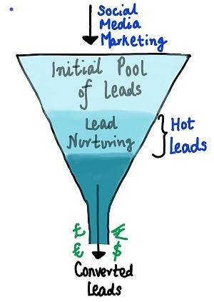

# Leads Scoring

## Leads Dataset
A lead in marketing terms is: "Simply defined, leads in marketing refer to any individual or organization within your marketing reach who has interacted with your brand way or has the potential to become a future customer. A lead can be someone that sees or downloads your content, signs up for a trial, or visits your store."  
The dataset basically includes various user data (e.g. contact preferences, source of the lead, time spent on website etc.) that can be used to assess whether a lead can be converted to a sale.

The aim is to perform lead scoring, in other words determine if a lead is worth passing from the marketing team on to sales based on the available data. As seen from the image we start from an initial pool of leads which then based on the features describing it can be a hot lead which will become a converted lead or in other words someone who will make a purchase.

Different models will be compared and the one with the best performance will be selected to be used in a lead prediction service so that the sales team knows-based on the data from marketing-which users can be potential customers. 

A description of the variables is in Leads Data Dictionary.xlsx

References:
- https://www.kaggle.com/datasets/ashydv/leads-dataset
- https://www.salesforce.com/products/guide/lead-gen/scoring-and-grading/
- https://www.wrike.com/marketing-guide/faq/what-is-a-lead-in-marketing/

## Environent setup
The environment used for development is based on the course of [machine-learning-zoomcamp](https://github.com/DataTalksClub/machine-learning-zoomcamp), in the context of which this project is conducted. A nice detailed guide can be found [here](https://github.com/MemoonaTahira/MLZoomcamp2022/blob/main/Notes/Week_5-flask_and_docker_for_deployment/readme.md).

For the bare minumus to run this code you will need:
- pipenv that is used for python package management, you can install it in your terminal with `pip install pipenv`
- To be able to utilize the environment you need to open up a terminal in this repo folder and type: `pipenv shell` to activate the virtual environment and install the dependencies described in the pipfiles.
- Docker set up for your system (if you do not have it already you can check the guide above for installing docker)
- A wsl distro if you are on windows (again you can find details in the above guide) or simply be on ubuntu. 
  
## Contents
- notebook.ipynb: the notebook where an exploratory data analysis (EDA) is conducted and the best performing model is selected
- Dockerfile: used to containerize the application
- Leads.csv: the dataset
- train.py: the script that trains the model based on the insights from the EDA in the notebook
- model.bin: the binary file that contains the trained model
- predict.py: the script used in the containerized application that creates a flask app for prediction using the model
- Pipfile & Pifile.lock: files used to set up the virtual environment for pipenv
- predict_test.py: script that tests the prediction app making a request to the prediction service. There are two example dictionaries that could be used (commenting one and uncommenting the other) to make the test requests.

## Exploratory Data Analysis
Insigths were found through an EDA on the dataset, in the notebook. In addition, 3 different models are compared to choose the one with the best performance.

## How to use
### Notebook with EDA
  After setting up the environment using pipenv you can open the notebook with: `jupyter notebook notebook.ipynb`
### Model training
  Simply open a terminal in this folder and type: `pipenv run python train.py`
### Running the service (local) and testing
1. Build the docker image using `docker build -t lead-scoring .`
2. Run the docker image and deploy the service locally using `docker run -it --rm -p 9696:9696 lead-scoring`
3. In a terminal with the pipenv environment activated type and run: `python predict_test.py`, this runs a test and should return the response from the service similar to the screenshot below.

This is what it should like:

Note: To stop serving use Crtl+C

## Things that could be done better and other remarks
- The part of handling the features, for e.g. which ones to drop which ones to keep could be set up perhaps in a better way so that it's customizable in a simpler way. Now the column names are hardcoded and this is probably not the cleanest option if a later EDA on newer datasets brings other insights in terms of feature importance etc.
- Generally wanted to do something more exotic other than the boilerplate used in the course for the scripts deploying the model, but in this case time was really limited, perhaps something to change in the future.
- Serving the app on a webserver instead of local deployment
- For serving the app on windows instead of ubuntu you could use waitress to serve the flask application, a few modifications might be needed in the Dockerfile and the pipfiles
